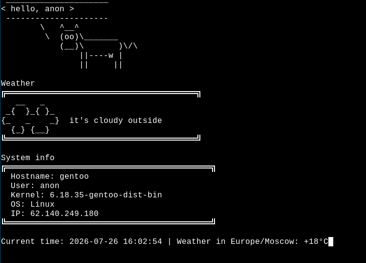

# sysweather
display of weather, time, and system information

## Requirements
1.gcc 
2.Internet connection

## Installation
1. Download sysweather.sh
~~~
git clone https://github.com/Efesint/sysweather
~~~
2. Compile the file
~~~
gcc sysweather.c -o sysweather -lcurl
~~~
3. Run it
```
./sysweather
```

## ⚠️Disclaimer
I'm still learning Linux administration and cpp. 
This project is a learning exercise, not production-ready software. 
But for casual use, I think it'll be quite usable. This is my second Bash project. 
Thanks for reading.
## upd
upd: i was too lazy to rewrite my bash script in c, so i use AI again. forgive me, great linus droidvalds
(My script was shitty code anyway, so I didn't even bother.)
