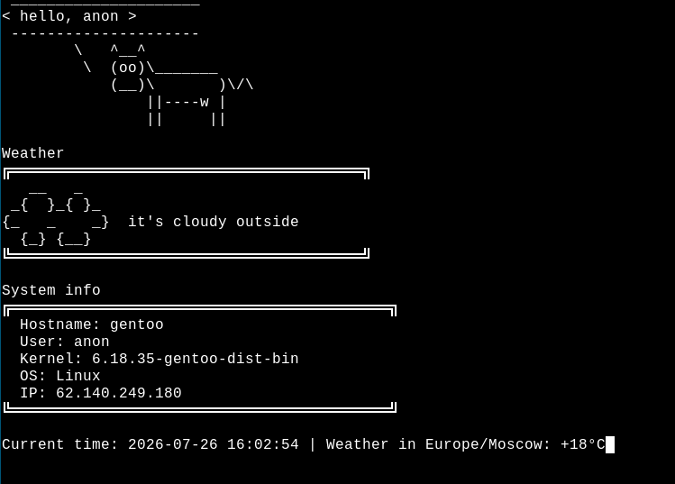

# sysweather
display of weather, time, and system information

## Requirements
1.C Compiler
<br>2.Internet connection
<br> 3. libcurl

## Installation
1. Download sysweather.sh
~~~
git clone https://github.com/Efesint/sysweather
~~~
2. Compile the file
~~~
gcc sysweather.c -o sysweather -lcurl
~~~
3. Run it
```
./sysweather
```

## First setup
Write your town like 'Europe/Berlin'.

# LICENSE 
This product is released under the GNU General Public License v3.0
